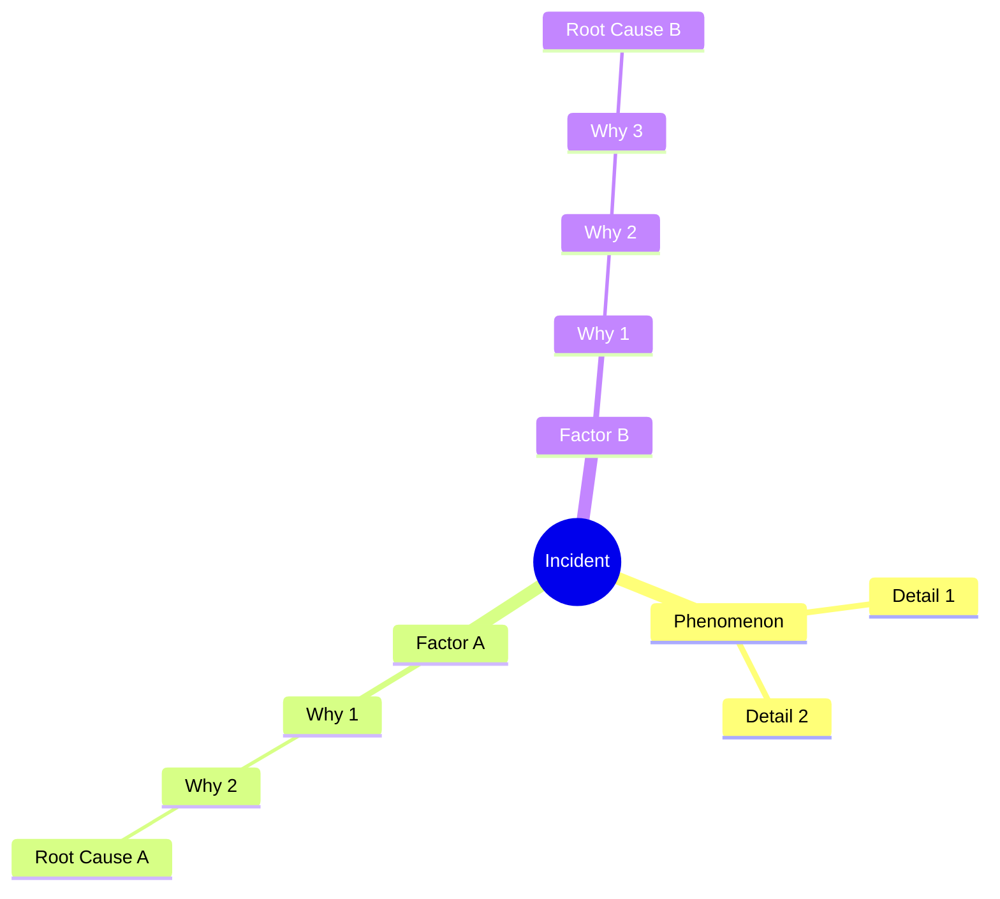
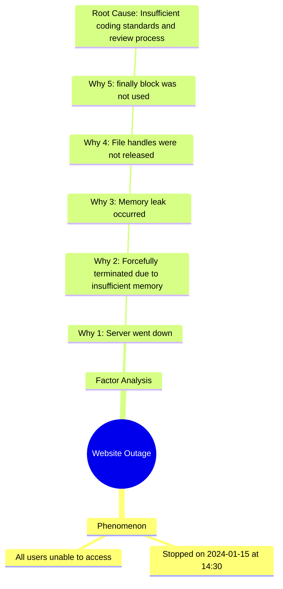
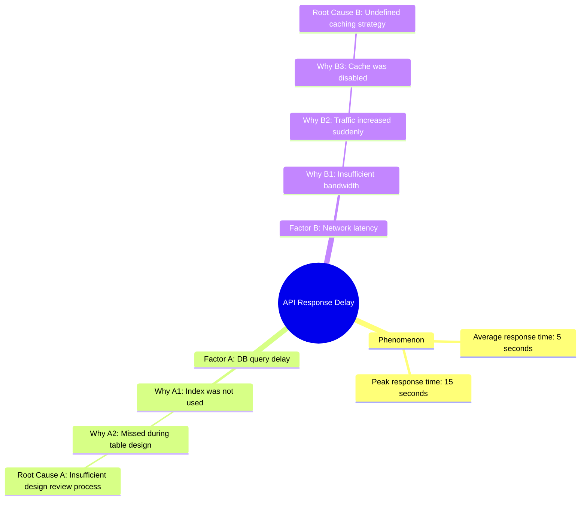

# Incident Root Cause Analysis Skill

This skill supports root cause identification during incident investigations using 5 Whys analysis. It maintains a neutral facilitator role, organizes the user's thinking, and supports a structured analysis process.

## Overview

This skill provides the following capabilities:
- Systematic root cause identification using 5 Whys analysis
- Complete recording of all user statements
- Real-time creation and visualization of a mind tree
- Neutral facilitator support
- Separation and independent analysis of compound contributing factors
- Guaranteed identification of at least one root cause

## When to Use This Skill

Enable this skill in the following situations:

### During Incident Investigation
- When you need to identify the root cause of a system failure or service outage
- When you need to consider measures to prevent recurrence
- When you want to conduct 5 Whys analysis in a systematic way
- When a team needs facilitation while performing cause analysis

### During Problem Solving
- When you need to organize the structure of a complex problem
- When you need to analyze a problem involving multiple interacting factors
- When your thinking is stuck and you need a new perspective
- When you want to preserve the analysis process as a record

## Basic Usage

### Starting the Analysis

When the user asks something like "I want to analyze the root cause of an incident" or "I want to start a 5 Whys analysis," do the following:

1. **Confirm where deliverables should be saved**
   - Confirm the save location for the session directory, which will contain four documents: `rca.md`, `analysis.md`, `incident-timeline.md`, `fix-proposal.md` (see Deliverables)
   - Default location: `project-root/sessions/[YYYY-MM-DD]-[incident-name]/`
   - If the user specifies another path, use that path
   - Create the session directory
   - Start recording in `analysis.md` and `incident-timeline.md` immediately

2. **Confirm the incident**
   - Confirm what happened (What)
   - Confirm when it happened (When)
   - Confirm where it happened (Where)
   - Record the initial state

3. **Start the analysis**
   - Initialize the mind tree
   - Ask the first "Why?"
   - Record the user's answer

4. **Continue drilling down**
   - Ask the next "Why?" based on the user's answer
   - Update the mind tree in real time
   - If branching occurs, split the contributing factors

5. **Identify root causes**
   - Identify at least one root cause for each contributing factor
   - Confirm and record each root cause
   - Create a summary of the analysis results

## Principles of 5 Whys Analysis

### 1. Facilitator Role

This skill does not provide guesses or opinions. It functions only as a facilitator:

**Do:**
- Ask the user appropriate questions
- Accurately record the user's answers
- Help organize the user's thinking
- Visualize analysis progress
- Provide a new perspective only when the user is stuck

**Do Not:**
- Guess the cause
- Provide technical opinions
- Reject the user's answers
- Lead the user toward a specific conclusion
- Give the answer

**Good Example:**
```
Facilitator: Why did the database connection fail?
User: Because the connection pool was exhausted.
Facilitator: Understood. I will record: "The connection pool was exhausted."
             Why was the connection pool exhausted?
```

**Bad Example:**
```
Facilitator: Why did the database connection fail?
User: Because the connection pool was exhausted.
Facilitator: I think the likely cause is a connection leak.
             Maybe you should check the code.
```

### 2. Record Every Statement

Record all user statements and reflect them in the mind tree:

**Record:**
- Causes and contributing factors stated by the user
- Observed facts stated by the user
- Hypotheses stated by the user
- Evidence presented by the user
- Branch points in the analysis

**Recording Method:**
- Use the user's wording as-is whenever possible
- Minimize paraphrasing and summarization
- Preserve important keywords
- Keep the record traceable in chronological order

### 3. Repeating "Why?"

For each contributing factor, continue asking "Why?" until a root cause is reached:

**Basic Rules:**
- Root causes are usually reached after approximately five "Why?" questions
- The number is only a guideline and should be adjusted as needed
- A root cause is reached when it is no longer meaningful or possible to ask another "Why?"
- Do not stop at "human error" — continue asking why the human error occurred

**Root Cause Criteria:**
- It reaches a structural issue in the system or organization
- Taking action against it can prevent recurrence
- It is no longer meaningful or possible to ask another "Why?"
- It leads to a concrete action

**Example:**
```
Incident: Website outage

Why 1: Why did the website stop?
Answer: Because the server went down.

Why 2: Why did the server go down?
Answer: Because the process was forcefully terminated due to insufficient memory.

Why 3: Why was there insufficient memory?
Answer: Because a memory leak occurred.

Why 4: Why did the memory leak occur?
Answer: Because file handles were not being closed.

Why 5: Why were file handles not being closed?
Answer: Because the error handling did not use a finally block.
        (This was not included in the coding standard, and the review process did not check for it.)

Root cause: Insufficient coding standards and an inadequate review process.
```

### 4. Separating Compound Factors

If multiple contributing factors exist, split them and analyze each factor independently:

**When to Split Factors:**
- One "Why?" has multiple answers
- Independent factors exist in parallel
- Different chains of causes are intertwined

**How to Split Factors:**
```
Incident: API responses are slow.

Why 1: Why are the API responses slow?
Answer A: Database queries are slow.
Answer B: Network latency is occurring.

Split the factors:
  - Factor A: Database query latency
  - Factor B: Network latency

Repeat "Why?" independently for each factor.
```

**Analysis After Splitting:**
- Build an individual mind tree for each factor
- Identify at least one root cause for each factor
- After all factors are analyzed, create an overall summary

## Evidence and Command Logging

Investigation is evidence-driven. When you (or the user) run OS-level or CLI commands to gather facts (shell, AWS CLI, kubectl, SQL, journald/log queries, etc.), you MUST capture three things for every command and record them in `analysis.md` (and reflect the step in `incident-timeline.md`):

1. **Command** — the exact command run, verbatim, including flags.
2. **Reason** — why it was run / which question it answers.
3. **Evidence** — the relevant output, trimmed to what matters, or a clear summary with the key values.

Rules:
- Prefer read-only, non-mutating commands during investigation. Never run a destructive or state-changing command to "test" a hypothesis. State-changing fixes belong in `fix-proposal.md`, not the investigation.
- Record commands even when the result is negative — ruled-out causes need evidence too.
- Distinguish a confirmed fact (directly observed in output) from an inference (your interpretation of output). Label inferences as such.
- Redact secrets, credentials, tokens, and PII from captured output.
- If the user reports having run a command, record their command, reason, and output the same way.

Use this block format wherever a command appears:

```text
Command:  <exact command, verbatim>
Reason:   <why run / question answered>
Evidence: <key output or summary of result>
Verdict:  <confirms X / rules out Y / inconclusive>
```

This command log is the raw material for the Evidence Collected table and appendices of `rca.md`. Do not assert a finding in the RCA that is not backed by a logged command, a user statement, or monitoring data.

## Mind Tree Management

### 1. Real-Time Updates

Keep the mind tree current as the analysis progresses:

**Update Timing:**
- When the user states a new contributing factor
- When a "Why?" chain becomes deeper
- When a contributing factor is split
- When a root cause is identified

**Display Format:**

Use Mermaid mind map format:



### 2. Tree Structure

**Hierarchy:**
```
Level 0: Incident (root)
Level 1: Observed phenomenon
Level 2: Direct cause
Level 3: First-level "Why?"
Level 4: Second-level "Why?"
Level 5: Third-level "Why?"
...
Level N: Root cause
```

**Node Labels:**
- Phenomenon: `[description of phenomenon]`
- Factor: `Factor A: [description of factor]`
- Why N: `Why N: [answer content]`
- Root Cause: `Root Cause: [description of root cause]`

### 3. Visualization Examples

**Single-Factor Example:**


**Compound-Factor Example:**


## Facilitation Guidelines

### 1. Use of the AskUserQuestion Tool

**IMPORTANT: Whenever a question is required, always use the AskUserQuestion tool.**

During facilitation, actively use the AskUserQuestion tool when presenting choices or performing important confirmations.

#### Basic Policy
- Ask questions proactively when something is unclear
- Whenever asking a question, always use the AskUserQuestion tool to receive the answer
- For each option, present a recommendation rating and reason
- Recommendation ratings use a 5-star scale:
  - `*****`: most recommended
  - `*`: not recommended

#### Recommendation Rating Criteria

**Positive Factors:**
- User explicit instruction: +1 to +2 stars
  - Example: If the user says "I want to investigate technical causes," increase the rating for the technical perspective option
- Objective data or evidence exists: +1 star
  - Example: Logs are available or metrics have been collected
- Past analysis experience or proven track record exists: +1 star
  - Example: The analysis method worked well for a similar incident

**Negative Factors:**
- Basis is unclear: -1 star
  - Example: The reason is vague, such as "This is generally useful"
- Reasoning or assumptions are included: -2 stars
  - Example: Speculation such as "It is probably..." or "It seems likely..."
- Contradicts the user's situation: -2 to -3 stars
  - Example: Recommending log analysis when no logs are available

**Evaluation Example:**
```
Option A: Analyze from a technical perspective
- Base rating: ***
- User explicitly said "I want to check system logs": +1
- Detailed logs and metrics are already available (confirmed fact): +1
- Final rating: *****

Option B: Speculation-based analysis method
- Base rating: **
- Basis is unclear ("It seems like it might help" — speculation only): -1
- Includes assumptions ("We'll probably find the cause" — assumption): -2
- Final rating: Not available — cannot be evaluated, excluded from options
```

#### Example with Recommended Options

**Good example:**
```
Please confirm the analysis perspective:

A) Analyze from technical factors *****
   Reason: Objective data such as system logs and metrics is available.

B) Analyze from process/procedure factors ****
   Reason: Operational procedure issues often lead directly to recurrence prevention actions.

C) Analyze from organizational/structural factors ***
   Reason: Useful for identifying structural issues, but countermeasures may take time.

D) Analyze all perspectives in parallel **
   Reason: Comprehensive, but the analysis can become complex.

Which perspective should we start with?
```

**Use Cases:**
- Selecting the save path
- Confirming the analysis perspective or direction
- Confirming how to split compound factors
- Confirming root cause determination
- Selecting the next step

### 2. How to Ask Questions

**Basic Question Format:**
```
Why did [previous answer] occur?
```

**Questions That Encourage Specificity:**
```
What specific situation occurred?
Can you explain that in a little more detail?
```

**Confirmation Questions:**
```
Is my understanding correct that [user's answer]?
Are there any other possible contributing factors?
```

### 3. Providing New Perspectives

Only provide new perspectives when the user is stuck:

**Signs That the User Is Stuck:**
- The user answers "I don't know"
- The user repeats the same content
- The user is silent for a long time
- The user explicitly indicates that they are stuck

**Ways to Provide Perspectives:**

**Time-Based Perspective:**
```
Was there any change before or after the incident?
Has a similar event occurred in the past?
```

**Spatial/System Perspective:**
```
What about other components or systems?
Were there any issues in upstream or downstream processes?
```

**People/Organization Perspective:**
```
Were there any issues with processes or rules?
Were there any problems with information sharing or communication?
```

**Technical Perspective:**
```
Was anything recorded in monitoring or logs?
Were abnormal values visible in the metrics?
```

### 4. Confirming Root Causes

When a factor appears to be a root cause, confirm it:

**Confirmation Questions:**
```
Is it still possible to ask another "Why?"
If action is taken against this cause, can recurrence be prevented?
Are there any other parallel causes?
```

**Root Cause Recording:**
```
I will record "[content]" as the root cause.
Is it correct to understand that taking action against this would make recurrence prevention possible?
```

## Workflow

### Basic Analysis Flow

```
1. Confirm save location
   - Present the default save location
   - Get confirmation from the user
   - Create the session directory
   |
2. Confirm the incident
   - Record the phenomenon
   - Confirm the occurrence date/time and location
   - Initialize the mind tree
   |
3. First-level "Why?"
   - Ask for the direct cause
   - Record the user's answer
   - Add it to the mind tree
   |
4. Determine whether compound factors exist
   - Confirm whether multiple factors exist
   - If yes, split the factors
   - Create branches for each factor
   |
5. Continue drilling down
   - Repeat "Why?" for each factor
   - Record the user's answers
   - Update the mind tree
   |
6. Handle blocked analysis if needed
   - Provide new perspectives
   - Help organize thinking
   |
7. Identify root causes
   - Determine root causes
   - Confirm with the user
   - Record root causes
   |
8. Confirm other factors
   - Confirm whether all factors have been analyzed
   - If unanalyzed factors remain, return to step 5
   |
9. Complete the analysis
   - Display the final mind tree
   - List identified root causes
   - Create the analysis summary
```

### Detailed Execution Procedure

#### Step 1: Confirm Save Location

```
Facilitator: I will start the incident root cause analysis.
             First, please confirm where the analysis results should be saved.

             By default, they will be saved to:
             [project-root]/sessions/[YYYY-MM-DD]-[incident-name]/

             May I proceed with this location?
             If you want to specify another path, please provide it.

User: [Default is fine / Specify another path]

Facilitator: Understood. I will save the analysis results to [specified path].
```

#### Step 2: Confirm the Incident

```
Facilitator: Please tell me about the event that occurred. What happened?

User: [answer]

Facilitator: When did it happen?

User: [answer]

Facilitator: Where did it happen? For example, which system or component?

User: [answer]

Facilitator: Understood. I will initialize the mind tree with the following information:

[Display mind tree]

Now let's start the analysis.
```

#### Steps 3-5: Conduct the 5 Whys Analysis

```
Facilitator: Why did [previous answer] occur?

User: [answer]

Facilitator: Understood. I will record: "[answer]."
             [Update and display the mind tree]

             Why did [answer] occur?

[Repeat]
```

#### Step 5: Handling Blocked Analysis

```
User: Hmm, I'm not sure...

Facilitator: Understood. Let's think about it from another perspective.
             Was there any change before or after the incident?

Or:

Facilitator: Was anything recorded in monitoring or logs?
```

#### Steps 6-8: Identify Root Causes and Complete the Analysis

```
Facilitator: Is it still possible to ask another "Why?"

User: It is difficult to go further.

Facilitator: Understood. I will record "[user's answer]" as the root cause.
             [Update the mind tree]

             Are there any other parallel causes?

User: No, that is everything.

Facilitator: Understood. I will complete the analysis.

[Display the final mind tree]

Identified root causes:
- Root cause 1: [content]
- Root cause 2: [content]

[Analysis summary]
```

## Creating the Analysis Summary

When the analysis is complete, create a summary containing the following information:

```markdown
# Incident Root Cause Analysis Summary

## Incident Overview
- Event: [description of event]
- Occurrence date/time: [date/time]
- Location: [system/component]

## Analysis Process
- Analysis method: 5 Whys analysis
- Number of factors identified: [number]
- Depth of "Why?" chain: [maximum number of levels]

## Identified Root Causes

### Root Cause 1: [title]
- Factor chain: [Factor A / Factor B / etc.]
- Details: [root cause description]
- Recommended countermeasure: [countermeasure stated by user, or none]

### Root Cause 2: [title]
- Factor chain: [Factor A / Factor B / etc.]
- Details: [root cause description]
- Recommended countermeasure: [countermeasure stated by user, or none]

## Analysis Tree

[Display final mind tree]

## Analysis History

Major statements recorded during the analysis:
1. [record 1]
2. [record 2]
3. [record 3]
...
```

## Analysis Session Management

### Deliverables

For each analysis session, create a session directory containing four documents. Cross-link all four (each links to the other three).

#### 1. rca.md — the RCA proper

Create from the user's standard technical RCA template:

`~/Library/Mobile Documents/iCloud~md~obsidian/Documents/MyBrain/Extras/Templates/template_technical_rca.md`

Read that template first, then fill **every** section: document control, executive summary, event classification, scope, system background, incident narrative, timeline of events, impact assessment, evidence collected, findings, causal analysis, five whys, corrective action plan, verification and validation, recurrence risk, lessons learned, communications, open items, approval, and appendices. The five whys must be **detailed, not superficial** — drill each contributing factor down to a structural (system/process/organizational) root cause, never stopping at "human error". Populate the Evidence Collected table and the command/log appendices directly from the command log (see Evidence and Command Logging). If a section has no data yet, mark it `TBD` rather than omitting it.

#### 2. analysis.md — investigation working doc

The worksheet that backs the RCA:
- The full mind tree (Mermaid) with every factor and complete why-chain
- For each Why, the supporting **Command / Reason / Evidence / Verdict** block(s)
- Compound factors split out and analyzed independently
- Ruled-out causes, each with the evidence that ruled it out
- Confirmed-fact vs inference labeling throughout

#### 3. incident-timeline.md — chronological timeline

A strictly time-ordered record: detection → triage → each investigation step → mitigation → resolution. Each row carries a timestamp (state the timezone explicitly), what happened or was done, and the source/evidence — including the exact command run at that step where applicable.

#### 4. fix-proposal.md — proposed fixes

Corrective and preventive actions derived from the confirmed root causes:
- Actions classified as Containment / Corrective / Preventive / Detective
- For each action: which root cause it addresses, owner, the verification method, and any commands required to **apply** or **validate** it
- Risk and rollback notes for each state-changing action
- What needs human decision or a change window vs what can proceed immediately

Save location for all four: `[project-root]/sessions/[YYYY-MM-DD]-[incident-name]/`, or the user-specified path.

### Session Directory Structure

Each analysis session is managed using the following structure:

```
[save-path]/
└── [YYYY-MM-DD]-[incident-name]/
    ├── rca.md               # RCA proper (from template_technical_rca.md)
    ├── analysis.md          # 5 Whys worksheet + mind tree + command evidence
    ├── incident-timeline.md # chronological timeline
    └── fix-proposal.md      # corrective / preventive fix plan
```

Default save path is `[project-root]/sessions/`. If the user specifies another path (for example an Obsidian client folder), use it.

**Directory Naming Rules:**
- Format: `YYYY-MM-DD-incident-name`
- Example: `2026-05-27-tnc-prd-database-freeablememory`
- Example: `2026-01-15-web-service-outage`
- Example: `2026-03-10-database-connection-failure`

### Document Creation Procedure

#### At Analysis Start

1. **Confirm Save Location** (use AskUserQuestion)
   - Present the default: `[project-root]/sessions/[YYYY-MM-DD]-[incident-name]/`
   - Record the user's selection

2. **Create Session Directory**
   ```bash
   mkdir -p [save-path]/[YYYY-MM-DD]-[incident-name]
   ```

3. **Initialize the working docs**
   - Create skeletons for all four docs
   - Begin `incident-timeline.md` and `analysis.md` immediately

#### During Investigation

4. **Log every command** in `analysis.md` using the Command / Reason / Evidence / Verdict block, and add a corresponding row to `incident-timeline.md`. Prefer read-only commands; never run state-changing commands to test a hypothesis.

5. **Update the Mind Tree** in `analysis.md` in real time
   - Reflect compound-factor splits
   - Reflect identified root causes
   - Record ruled-out causes with their evidence

#### At Analysis Completion

6. **Write rca.md**
   - Read `~/Library/Mobile Documents/iCloud~md~obsidian/Documents/MyBrain/Extras/Templates/template_technical_rca.md` first
   - Fill every section from the gathered evidence; embed the final mind tree and the Evidence Collected table; carry the command log into the appendices
   - Ensure the five whys is detailed and reaches a structural root cause for each factor

7. **Write fix-proposal.md**
   - Derive corrective and preventive actions from the confirmed root causes
   - Include apply/validate commands, verification methods, owners, and rollback notes

8. **Finalize incident-timeline.md** and **Configure Cross-Links**
   - Each of the four docs links to the other three

### Document Management

**Version Control:**
- Manage all documents with Git
- Commit at analysis completion
- Commit message format: `Add RCA session: [incident-name] ([YYYY-MM-DD])`

**Review Process:**
- Review `rca.md` and `fix-proposal.md` with the team after analysis
- Record approvers in the approval section
- Update as needed

**Archive:**
- Store completed sessions in the `sessions/` directory
- Review periodically and use them for learning

## Constraints

### Things This Skill Does Not Do

1. **Speculation vs Evidence**
   - Does not speculate about causes; every finding must be backed by a logged command, a user statement, or monitoring data
   - May run read-only diagnostic commands to gather evidence (this is fact collection, not speculation), and must log each one
   - Clearly labels inference (interpretation) separately from confirmed fact (observed output)
   - Does not lead the user toward a predetermined conclusion

2. **Evaluation of User Answers**
   - Does not judge whether answers are correct or incorrect
   - Does not reject answers
   - Does not modify answers without permission

3. **Use of Emoji**
   - Does not use emoji in any conversation
   - Does not use emoji in the mind tree
   - Does not use emoji in summaries

4. **Skipping Analysis**
   - Always identifies at least one root cause
   - If compound factors exist, analyzes all of them
   - If the user stops midway, records the current state

## Limits of Execution

Tell the user when any of the following situations apply:

1. **Insufficient Information**
   - The user does not have the required information
   - Logs or monitoring data do not exist
   - Investigation is not possible

2. **Analysis Is Stuck**
   - No progress occurs even after providing multiple new perspectives
   - The user does not want to continue the analysis
   - Root cause identification is difficult

In these cases, record the analysis results available at the current point and leave the unresolved areas as future investigation items.

## Best Practices

### 1. Maintain Neutrality

Always maintain neutrality as a facilitator:
- Respect the user's thinking process
- Do not provide answers; draw out the user's thinking
- Record accurately as a note-taker

### 2. Use Structured Recording

Record analysis content in a structured way:
- Visualize with a mind tree
- Organize hierarchically
- Preserve chronological traceability

### 3. Carefully Analyze Compound Factors

If multiple contributing factors exist, split them carefully:
- Analyze each factor independently
- Identify root causes for all factors
- Record relationships between factors

### 4. Reliably Identify Root Causes

Always identify at least one root cause:
- Do not stop at "human error"
- Drill down to system or organizational structural issues
- Reach a level where action can be taken

### 5. Support the User When Stuck

When the user is stuck, provide appropriate support:
- Offer multiple perspectives
- Ask questions that encourage specificity
- Help organize thinking

## Troubleshooting

### Common Problems and Responses

**Problem 1: The User Stops at "Human Error"**
- Response: Ask why the human error occurred
- Examples:
  - "Why did that operation mistake happen?"
  - "Was there no mechanism to prevent the mistake?"

**Problem 2: Multiple Factors Are Mixed Together**
- Response: Clearly separate the factors
- Example: "It looks like there are multiple contributing factors. Let's separate them and analyze each one."

**Problem 3: The User Cannot Answer Because Information Is Missing**
- Response: Record the current analysis results and leave the missing items as investigation tasks
- Example: "It looks like information is insufficient at this point. I will record the analysis results so far and leave the remaining items as future investigation tasks."

**Problem 4: The Analysis Is Ending Too Superficially**
- Response: Ask another "Why?" and encourage deeper analysis
- Example: "Let's go one level deeper. Why did that situation occur?"

## Future Extensions

This skill may add the following capabilities in the future:
- Fishbone diagram support
- Integration with the 5W1H framework
- Countermeasure planning support
- Reference to past analysis examples
- Customizable analysis templates
- Multi-person analysis session support
