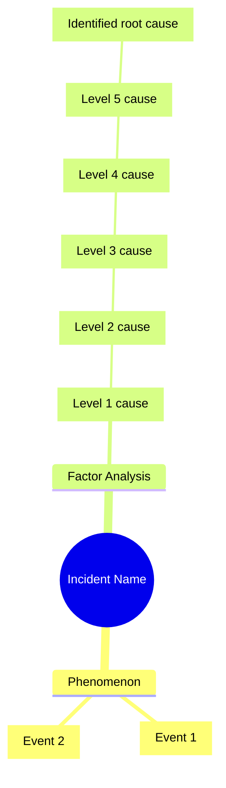

# Incident Root Cause Analysis Results

## Overview

**Analysis Date/Time**: [YYYY-MM-DD HH:MM]
**Analyst**: [Analyst Name]
**Analysis Method**: 5 Whys Analysis

## Incident Details

### Event
[Describe what happened]

### Date/Time of Occurrence
[YYYY-MM-DD HH:MM]

### Location
[System name / Component name / Environment]

### Scope of Impact
[Number of affected users, services, and functions]

### Detection Method
[How the incident was detected]

## Analysis Process

**Number of factors identified**: [number]
**Maximum "Why?" depth**: [number] levels
**Analysis duration**: [duration]

## Root Cause Analysis Tree

*For compound factors, add a branch per factor.*

## Identified Root Causes

### Root Cause 1: [Root Cause Title]

**Factor chain**: [Single factor / Factor A / Factor B / etc.]

**Details**:
[Detailed explanation of the root cause]

**Why this is a root cause**:
- [Reason 1]
- [Reason 2]
- [Reason 3]

### Root Cause 2: [Root Cause Title]

*Compound factors only*

**Factor chain**: [Factor A / Factor B / etc.]

**Details**:
[Detailed explanation of the root cause]

**Why this is a root cause**:
- [Reason 1]
- [Reason 2]

## Recurrence Prevention Measures

### Measures for Root Cause 1

#### Immediate Response (Emergency Measures)
- [ ] [Measure 1: specific action]
  - Owner: [Name]
  - Due: [YYYY-MM-DD]
  - Status: [Not started / In progress / Complete]

- [ ] [Measure 2: specific action]
  - Owner: [Name]
  - Due: [YYYY-MM-DD]
  - Status: [Not started / In progress / Complete]

#### Permanent Countermeasures
- [ ] [Measure 1: specific action]
  - Owner: [Name]
  - Due: [YYYY-MM-DD]
  - Status: [Not started / In progress / Complete]

- [ ] [Measure 2: specific action]
  - Owner: [Name]
  - Due: [YYYY-MM-DD]
  - Status: [Not started / In progress / Complete]

#### Process Improvements
- [ ] [Measure 1: specific action]
  - Owner: [Name]
  - Due: [YYYY-MM-DD]
  - Status: [Not started / In progress / Complete]

### Measures for Root Cause 2

*Compound factors only*

#### Immediate Response (Emergency Measures)
- [ ] [Measure 1: specific action]
  - Owner: [Name]
  - Due: [YYYY-MM-DD]
  - Status: [Not started / In progress / Complete]

#### Permanent Countermeasures
- [ ] [Measure 1: specific action]
  - Owner: [Name]
  - Due: [YYYY-MM-DD]
  - Status: [Not started / In progress / Complete]

## Countermeasure Effectiveness Metrics

### Measurement Indicators

| Indicator | Current Value | Target Value | Measurement Method | Frequency |
|-----------|--------------|--------------|-------------------|-----------|
| [Indicator 1] | [value] | [value] | [method] | [frequency] |
| [Indicator 2] | [value] | [value] | [method] | [frequency] |
| [Indicator 3] | [value] | [value] | [method] | [frequency] |

### Effectiveness Review Date
[YYYY-MM-DD]

## Lessons Learned

### What Went Well
- [Item 1]
- [Item 2]

### Areas for Improvement
- [Item 1]
- [Item 2]

### Actions to Propagate to Other Systems/Teams
- [Item 1]
- [Item 2]

## Related Documents

- Analysis Log: [link to log.md]
- Incident Ticket: [ticket URL]
- Related Incident Reports: [document link]
- Reference Materials: [link]

## Approval

**Author**: [Name] ([YYYY-MM-DD])
**Reviewer**: [Name] ([YYYY-MM-DD])
**Approver**: [Name] ([YYYY-MM-DD])

---

**Last Updated**: [YYYY-MM-DD]
**Version**: 1.0
